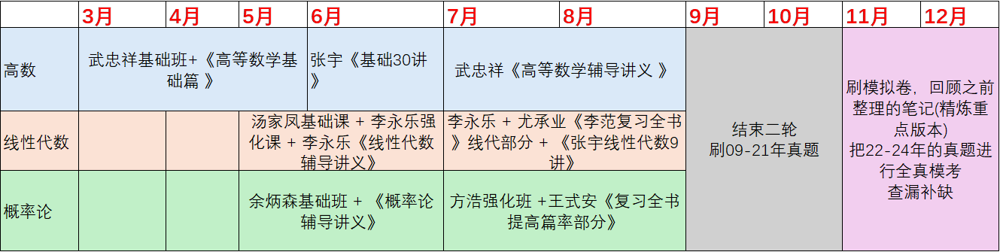
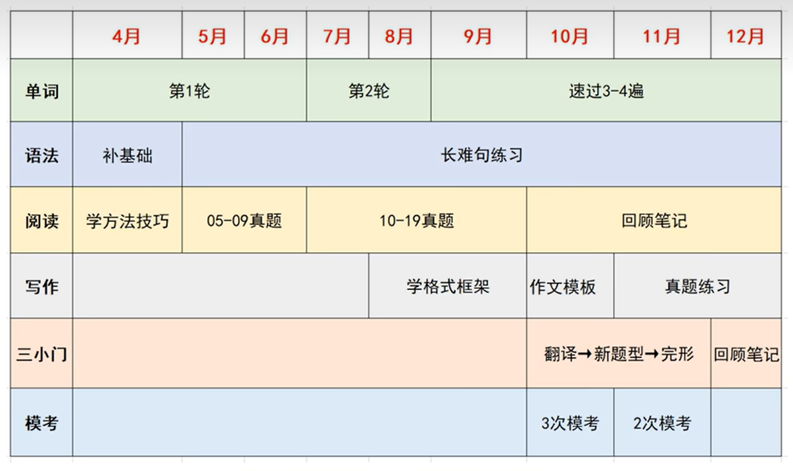
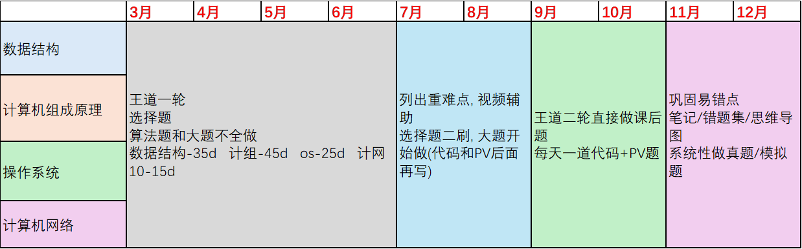
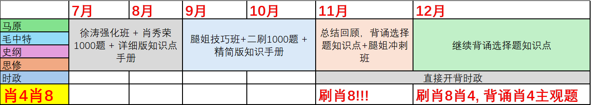

# 考研记录

> 记录考研每日完成的任务 进行一个打卡
>
> 上次更新链接:	24/5/26
>
> 上次日更新:		24/5/26
>
> 下次更新链接:	24/6/2

## 考研计划(V3.6)

> **总计划**
>
> + 3-6 基础
>   + 数学: 结束一轮复习
>   + 英语: 一轮单词 重学语法 阅读方法
>   + 政治: 不开始
>   + 专业课
> + 7-8 强化
>   + 数学: 结束二轮强化复习
>   + 英语: 阅读+小三门+作文
>   + 政治: 徐涛强化班 + 肖秀荣1000题
>   + 专业课
> + 9-10 冲刺
>   + 数学: 刷真题
>   + 英语: 结束阅读技巧 开始刷真题
>   + 政治: 腿姐技巧班+二刷1000题
>   + 专业课
> + 11-12 巩固
>   + 数学: 复习重点笔记+错题 持续刷题
>   + 英语: 真题 + 模拟试卷 + 作文模板
>   + 政治: 知识点总结，背诵选择题知识点+时政 刷肖8肖4
>   + 专业课

### 数学



### 英语



### 专业课



### 政治



---------------

## 当前项目(周更新)

> 上次更新: 24/5/26
>
> 下次更新: 24/6/2

+ ```mermaid
  gantt
      title 当天计划完成情况图
      todayMarker stroke-width:5px,stroke:#0f0,opacity:0.5
      todayMarker off
      dateFormat X
      axisFormat %s
      section 高数-R1
      79%   : 0, 79
      section 高数-R2
      29%   : 0, 29
      section 红书习题册
      40%   : 0, 40
      section 线代-L
      30%   : 0, 30
      section 线代习题册
      10%   : 0, 10
      section 概率论-L
      15%   : 0, 15
      section 英语-单词
      34%   : 0, 34
      section 英语-技巧
      10%   : 0, 10
      section 数据结构-L
      71%   : 0, 71
      section 编译原理-P
     	40%   : 0, 40
      
  ```
| 高数          | 概率论     | 线性代数   | 数据结构     | 英语   |
| ------------- | ---------- | ---------- | ------------ | ------ |
| 红书基础篇-R1 | 余丙森-C   | 汤家凤-C   | 王道-C       | 背单词 |
| 红书基础篇-R2 | 余蓝习题册 | 红书习题册 | 王道课后习题 | 阅读课 |
| 红书习题册    |            |            | 王道R1       |        |

## 每日记录

### 日历

> [五月](#每日记录-日历-五月)

|                     |     Mon     |     Tue     |     Wed     |     Thu     |     Fri     | Sat  | Sun  |
| ------------------- | :---------: | :---------: | :---------: | :---------: | :---------: | :--: | :--: |
| Week 18             |             |             |      1      |      2      |      3      |  4   |  5   |
| Week 19             |      6      |      7      |      8      |      9      |     10      |  11  |  12  |
| Week 20             |     13      |     14      |     15      |     16      |     17      |  18  |  19  |
| Week 21             |     20      |     21      |     22      |     23      |     24      |  25  |  26  |
| [Week 22](#Week 22) | [27](#5.27) | [28](#5.28) | [29](#5.29) | [30](#5.30) | [31](#5.31) |      |      |

> [六月](#每日记录-日历-六月)

|                     | Mon  | Tue  | Wed  | Thu  | Fri  |    Sat    |    Sun    |
| ------------------- | :--: | :--: | :--: | :--: | :--: | :-------: | :-------: |
| [Week 22](#Week 22) |      |      |      |      |      | [1](#6.1) | [2](#6.2) |
| [Week 23](#Week 23) |  3   |  4   |  5   |  6   |  7   |     8     |     9     |
| [Week 24](#Week 24) |  10  |  11  |  12  |  13  |  14  |    15     |    16     |
| [Week 25](#Week 25) |  17  |  18  |  19  |  20  |  21  |    22     |    23     |
| [Week 26](#Week 26) |  24  |  25  |  26  |  27  |  28  |    29     |    30     |

> [七月](#每日记录-日历-七月)

|                     | Mon  | Tue  | Wed  | Thu  | Fri  | Sat  | Sun  |
| ------------------- | :--: | :--: | :--: | :--: | :--: | :--: | :--: |
| [Week 27](#Week 27) |  1   |  2   |  3   |  4   |  5   |  6   |  7   |
| [Week 28](#Week 28) |  8   |  9   |  10  |  11  |  12  |  13  |  14  |
| [Week 29](#Week 29) |  15  |  16  |  17  |  18  |  19  |  20  |  21  |
| [Week 30](#Week 30) |  22  |  23  |  24  |  25  |  26  |  27  |  28  |
| [Week 31](#Week 31) |  29  |  30  |  31  |      |      |      |      |

> [八月](#每日记录-日历-八月)

|                     | Mon  | Tue  | Wed  | Thu  | Fri  | Sat  | Sun  |
| ------------------- | :--: | :--: | :--: | :--: | :--: | :--: | :--: |
| [Week 31](#Week 31) |      |      |      |  1   |  2   |  3   |  4   |
| [Week 32](#Week 32) |  5   |  6   |  7   |  8   |  9   |  10  |  11  |
| [Week 33](#Week 33) |  12  |  13  |  14  |  15  |  16  |  17  |  18  |
| [Week 34](#Week 34) |  19  |  20  |  21  |  22  |  23  |  24  |  25  |
| [Week 35](#Week 35) |  26  |  27  |  28  |  29  |  30  |  31  |      |

> [九月](#每日记录-日历-九月)

| Mon  | Tue  | Wed  | Thu  | Fri  | Sat  | Sun  |
| :--: | :--: | :--: | :--: | :--: | :--: | :--: |
|      |      |      |      |      |      |  1   |
|  2   |  3   |  4   |  5   |  6   |  7   |  8   |
|  9   |  10  |  11  |  12  |  13  |  14  |  15  |
|  16  |  17  |  18  |  19  |  20  |  21  |  22  |
|  23  |  24  |  25  |  26  |  27  |  28  |  29  |
|  30  |      |      |      |      |      |      |

> [十月](#每日记录-日历-十月)

| Mon  | Tue  | Wed  | Thu  | Fri  | Sat  | Sun  |
| :--: | :--: | :--: | :--: | :--: | :--: | :--: |
|      |  1   |  2   |  3   |  4   |  5   |  6   |
|  7   |  8   |  9   |  10  |  11  |  12  |  13  |
|  14  |  15  |  16  |  17  |  18  |  19  |  20  |
|  21  |  22  |  23  |  24  |  25  |  26  |  27  |
|  28  |  29  |  30  |  31  |      |      |      |

> [十一月](#每日记录-日历-十一月)

| Mon  | Tue  | Wed  | Thu  | Fri  | Sat  | Sun  |
| :--: | :--: | :--: | :--: | :--: | :--: | :--: |
|      |      |      |      |  1   |  2   |  3   |
|  4   |  5   |  6   |  7   |  8   |  9   |  10  |
|  11  |  12  |  13  |  14  |  15  |  16  |  17  |
|  18  |  19  |  20  |  21  |  22  |  23  |  24  |
|  25  |  26  |  27  |  28  |  29  |  30  |      |

> [十二月](#每日记录-日历-十二月)

| Mon  | Tue  | Wed  | Thu  | Fri  | Sat  | Sun  |
| :--: | :--: | :--: | :--: | :--: | :--: | :--: |
|      |      |      |      |      |      |  1   |
|  2   |  3   |  4   |  5   |  6   |  7   |  8   |
|  9   |  10  |  11  |  12  |  13  |  14  |  15  |
|  16  |  17  |  18  |  19  |  20  |  21  |  22  |
|  23  |  24  |  25  |  26  |  27  |  28  |  29  |
|  30  |  31  |      |      |      |      |      |

### 每日规划

**<span id="每日记录-日历-五月">五月</span>**

+ <span id="Week 22">Week 22</span>

  + <span id="5.27">5.27 周一</span>

    > 1. 当天计划
    >
    > 2. 计划完成情况
    >
    >    ```mermaid
    >    gantt
    >        title 当天计划完成情况图
    >        todayMarker stroke-width:5px,stroke:#0f0,opacity:0.5
    >        todayMarker off
    >        dateFormat X
    >        axisFormat %s
    >        section 高数
    >        100%   : 0, 100
    >        任务2-20%   : 0, 30
    >        section 线性代数
    >        任务1-100%   : 0, 100
    >        任务2-50%   : 0, 50
    >        section 概率论
    >        任务1-20%   : 0, 20
    >    ```
    >
    >    + 已完成
    >    + 未完成
    >
    > 3. 总结/期待/评价/碎碎念
    >
    >    + 总结
    >    + 期待
    >    + 评价：★★★★★☆☆☆☆☆
    >
    > 4. 影像资料
    
  + <span id="5.28">5.28 周二</span>
  
    > 1. 当天计划
    >
    > 2. 计划完成情况
    >
    >    ```mermaid
    >    gantt
    >        title 当天计划完成情况图
    >        todayMarker stroke-width:5px,stroke:#0f0,opacity:0.5
    >        todayMarker off
    >        dateFormat X
    >        axisFormat %s
    >        section 高数
    >        100%   : 0, 100
    >        任务2-20%   : 0, 30
    >        section 线性代数
    >        任务1-100%   : 0, 100
    >        任务2-50%   : 0, 50
    >        section 概率论
    >        任务1-20%   : 0, 20
    >    ```
    >
    >    + 已完成
    >    + 未完成
    >
    > 3. 总结/期待/评价/碎碎念
    >
    >    + 总结
    >    + 期待
    >    + 评价：★★★★★☆☆☆☆☆
    >
    > 4. 影像资料
  
  + <span id="5.29">5.29 周三</span>
  
    > 1. 当天计划
    >
    > 2. 计划完成情况
    >
    >    ```mermaid
    >    gantt
    >        title 当天计划完成情况图
    >        todayMarker stroke-width:5px,stroke:#0f0,opacity:0.5
    >        todayMarker off
    >        dateFormat X
    >        axisFormat %s
    >        section 高数
    >        100%   : 0, 100
    >        任务2-20%   : 0, 30
    >        section 线性代数
    >        任务1-100%   : 0, 100
    >        任务2-50%   : 0, 50
    >        section 概率论
    >        任务1-20%   : 0, 20
    >    ```
    >
    >    + 已完成
    >    + 未完成
    >
    > 3. 总结/期待/评价/碎碎念
    >
    >    + 总结
    >    + 期待
    >    + 评价：★★★★★☆☆☆☆☆
    >
    > 4. 影像资料
  
  + <span id="5.30">5.30 周四</span>
  
    > 1. 当天计划
    >
    > 2. 计划完成情况
    >
    >    ```mermaid
    >    gantt
    >        title 当天计划完成情况图
    >        todayMarker stroke-width:5px,stroke:#0f0,opacity:0.5
    >        todayMarker off
    >        dateFormat X
    >        axisFormat %s
    >        section 高数
    >        100%   : 0, 100
    >        任务2-20%   : 0, 30
    >        section 线性代数
    >        任务1-100%   : 0, 100
    >        任务2-50%   : 0, 50
    >        section 概率论
    >        任务1-20%   : 0, 20
    >    ```
    >
    >    + 已完成
    >    + 未完成
    >
    > 3. 总结/期待/评价/碎碎念
    >
    >    + 总结
    >    + 期待
    >    + 评价：★★★★★☆☆☆☆☆
    >
    > 4. 影像资料
  
  + <span id="5.31">5.31 周五</span>
  
    > 1. 当天计划
    >
    > 2. 计划完成情况
    >
    >    ```mermaid
    >    gantt
    >        title 当天计划完成情况图
    >        todayMarker stroke-width:5px,stroke:#0f0,opacity:0.5
    >        todayMarker off
    >        dateFormat X
    >        axisFormat %s
    >        section 高数
    >        100%   : 0, 100
    >        任务2-20%   : 0, 30
    >        section 线性代数
    >        任务1-100%   : 0, 100
    >        任务2-50%   : 0, 50
    >        section 概率论
    >        任务1-20%   : 0, 20
    >    ```
    >
    >    + 已完成
    >    + 未完成
    >
    > 3. 总结/期待/评价/碎碎念
    >
    >    + 总结
    >    + 期待
    >    + 评价：★★★★★☆☆☆☆☆
    >
    > 4. 影像资料

**<span id="每日记录-日历-六月">六月</span>**

+ Week 22

  + <span id="6.1">6.1 周六</span>

    > 1. 当天计划
    >
    > 2. 计划完成情况
    >
    >    ```mermaid
    >    gantt
    >        title 当天计划完成情况图
    >        todayMarker stroke-width:5px,stroke:#0f0,opacity:0.5
    >        todayMarker off
    >        dateFormat X
    >        axisFormat %s
    >        section 高数
    >        100%   : 0, 100
    >        任务2-20%   : 0, 30
    >        section 线性代数
    >        任务1-100%   : 0, 100
    >        任务2-50%   : 0, 50
    >        section 概率论
    >        任务1-20%   : 0, 20
    >    ```
    >
    >    + 已完成
    >    + 未完成
    >
    > 3. 总结/期待/评价/碎碎念
    >
    >    + 总结
    >    + 期待
    >    + 评价：★★★★★☆☆☆☆☆
    >
    > 4. 影像资料

  + <span id="6.2">6.2 周天</span>

    > 1. 当天计划
    >
    > 2. 计划完成情况
    >
    >    ```mermaid
    >    gantt
    >        title 当天计划完成情况图
    >        todayMarker stroke-width:5px,stroke:#0f0,opacity:0.5
    >        todayMarker off
    >        dateFormat X
    >        axisFormat %s
    >        section 高数
    >        100%   : 0, 100
    >        任务2-20%   : 0, 30
    >        section 线性代数
    >        任务1-100%   : 0, 100
    >        任务2-50%   : 0, 50
    >        section 概率论
    >        任务1-20%   : 0, 20
    >    ```
    >
    >    + 已完成
    >    + 未完成
    >
    > 3. 总结/期待/评价/碎碎念
    >
    >    + 总结
    >    + 期待
    >    + 评价：★★★★★☆☆☆☆☆
    >
    > 4. 影像资料

+ <span id="Week 23">Week 23</span>


**<span id="每日记录-日历-七月">七月</span>**

**<span id="每日记录-日历-八月">八月</span>**

**<span id="每日记录-日历-九月">九月</span>**

**<span id="每日记录-日历-十月">十月</span>**

**<span id="每日记录-日历-十一月">十一月</span>**

**<span id="每日记录-日历-十二月">十二月</span>**

------------------

## 笔记存档

### 数学

+ 高数
+ 线性代数
+ 概率论

### 英语

### 专业课

+ 数据结构
+ 计算机组成原理
+ 操作系统
+ 计算机网络

### 政治

