<span id="5.27">5.27 周一</span>

> 1. 当天计划
>
> 2. 计划完成情况
>
>    ```mermaid
>    gantt
>        title 当天计划完成情况图
>        dateFormat X
>        axisFormat %s
>        
>        section 高数网课
>        71   : 0, 71
>        section 高数做题
>        36   : 0, 36
>        section 英语单词
>        34   : 0, 34
>        section 数据结构
>        9    : 0, 9
>        section 乱七八糟的
>        5    : 0, 5
>    
>    ```
>
>    + 已完成
>    + 未完成
>
> 3. 总结/期待/评价
>
>    | 总结 | 期待 | 评价 |
>    | ---- | ---- | ---- |
>    |      |      |      |
>
> 
>
> 4. 影像资料


[甘特图 | Mermaid 中文网 (nodejs.cn)](https://mermaid.nodejs.cn/syntax/gantt.html#milestones)

```mermaid
gantt
    title 当天计划完成情况图
    todayMarker stroke-width:5px,stroke:#0f0,opacity:0.5
    todayMarker on
    dateFormat X
    axisFormat %s
    section 高数网课
    71   : 0, 71
    section 高数做题
    36   : 0, 36
    section 英语单词
    34   : 0, 34
    section 数据结构
    9    : 0, 9
    section 乱七八糟的
    5    : 0, 5
```



