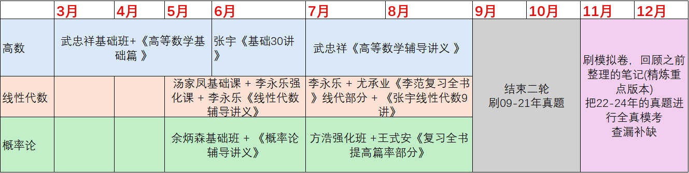
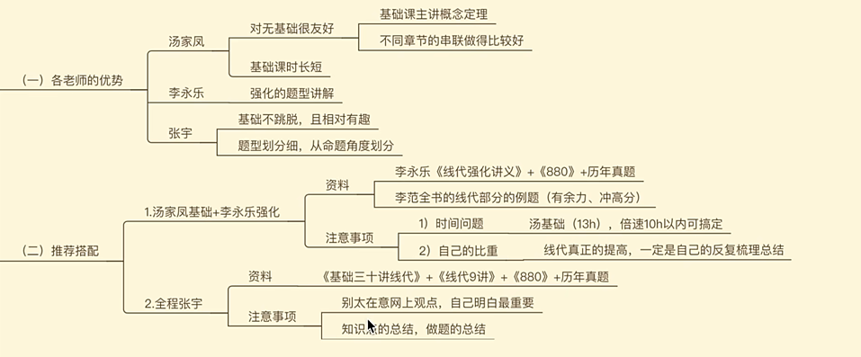
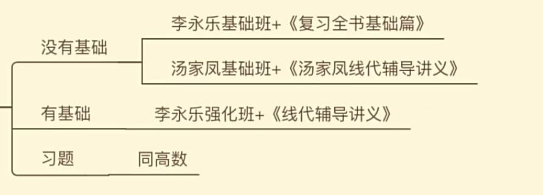
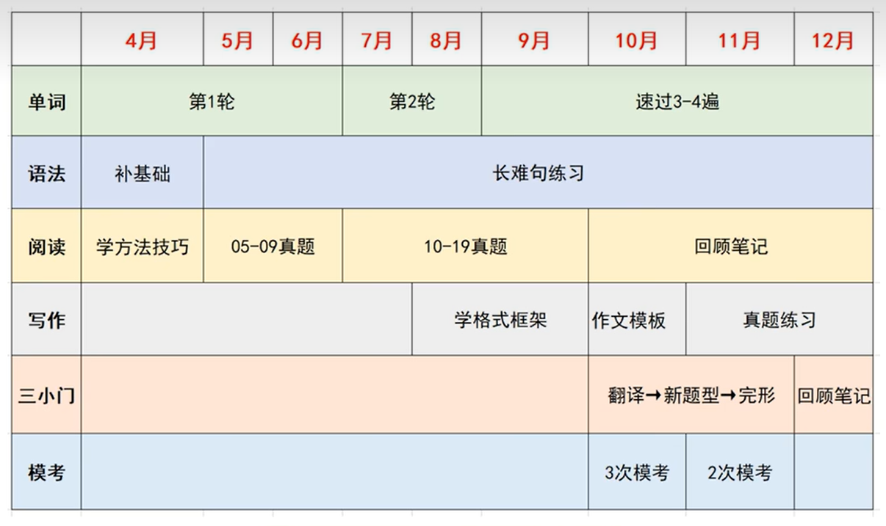

# 考研计划

## 总计划

:warning:每天还要稍微练练字

+ **3-6 基础**
  + 数学: 结束一轮复习
  + 英语: 一轮单词 重学语法 阅读方法
  + 政治: 不开始
  + 专业课
+ **7-8 强化**
  + 数学: 结束二轮强化复习
  + 英语: 阅读+小三门+作文
  + 政治: 徐涛强化班 + 肖秀荣1000题
  + 专业课
+ **9-10 冲刺**
  + 数学: 刷真题
  + 英语: 结束阅读技巧 开始刷真题
  + 政治: 腿姐技巧班+二刷1000题
  + 专业课
+ **11-12 巩固**
  + 数学: 复习重点笔记+错题 持续刷题
  + 英语: 真题 + 模拟试卷 + 作文模板
  + 政治: 知识点总结，背诵选择题知识点+时政 刷肖8肖4
  + 专业课

## 参考资料

+ :star::star::star::star::star: [硕士专业目录_中国研究生招生信息网 (chsi.com.cn)](https://yz.chsi.com.cn/zsml/queryAction.do)下面是咒语
+ ==基础信息==[【考研】考研常识合集，关于考研，你想知道的事！_哔哩哔哩_bilibili](https://www.bilibili.com/video/BV1bo4y1X7PZ/?spm_id_from=333.337.search-card.all.click&vd_source=57394b964496ff75b32c2ebcf3c76481)
+ [【考研441分】25考研全年复习规划+时间安排！B站最全！_哔哩哔哩_bilibili](https://www.bilibili.com/video/BV1mF4m1L7H7/?spm_id_from=333.337.search-card.all.click&vd_source=57394b964496ff75b32c2ebcf3c76481)
+ [【考研441分】24考研全年必买书单 | 别浪费钱和时间](https://www.bilibili.com/video/BV1MZ4y1C7ZK/?share_source=copy_web&vd_source=89823c744096e29cafad55e0e1765912)
+ [【23考研数学】140学姐教你，基础阶段怎么听课选老师_哔哩哔哩_bilibili](https://www.bilibili.com/video/BV1u34y1t7ii/?spm_id_from=333.337.search-card.all.click&vd_source=57394b964496ff75b32c2ebcf3c76481)
+ [【数学148】24考研数学全程规划｜8分钟理清复习思路｜效率max_哔哩哔哩_bilibili](https://www.bilibili.com/video/BV1ov4y187zr/?spm_id_from=333.337.search-card.all.click)
+ [初试453｜数一144｜25考研【数学全年规划】时间安排+参考资料｜保姆级分享，高分必看！_哔哩哔哩_bilibili](https://www.bilibili.com/video/BV1Fu4m1A7G2/?spm_id_from=333.337.search-card.all.click&vd_source=57394b964496ff75b32c2ebcf3c76481)
+ [【考研421分】25考研数学全年规划！巨详细！_哔哩哔哩_bilibili](https://www.bilibili.com/video/BV1Tw4m1f7DV/?spm_id_from=333.337.search-card.all.click&vd_source=57394b964496ff75b32c2ebcf3c76481)
+ ==英语==[田静+唐迟+颉斌斌 | 考研英语80+最佳复习方案_哔哩哔哩_bilibili](https://www.bilibili.com/video/BV1T24y1w7ve/?spm_id_from=333.337.search-card.all.click&vd_source=57394b964496ff75b32c2ebcf3c76481)
+ [『英一80分』b站最全考研英语全年全板块规划｜备考阶段划分及名师推荐｜书籍购买指南｜备考注意事项_哔哩哔哩_bilibili](https://www.bilibili.com/video/BV1KU4y1f7WM/?spm_id_from=333.337.search-card.all.click&vd_source=57394b964496ff75b32c2ebcf3c76481)
+ ==英语==[25考研党必看！2-12月英语这样规划才能上岸！_哔哩哔哩_bilibili](https://www.bilibili.com/video/BV1Zv42117vS/?spm_id_from=333.337.search-card.all.click&vd_source=57394b964496ff75b32c2ebcf3c76481)
+ [【考研英语80+】25考研全年时间+学习规划，但1个月能学完的极简主义备考策略_哔哩哔哩_bilibili](https://www.bilibili.com/video/BV15C411p735/?spm_id_from=333.337.search-card.all.click&vd_source=57394b964496ff75b32c2ebcf3c76481)
+ [【考研英语83分经验分享】按照这个复习流程，考研英语我考了83分_哔哩哔哩_bilibili](https://www.bilibili.com/video/BV1r44y1M7Nd/?spm_id_from=333.337.search-card.all.click&vd_source=57394b964496ff75b32c2ebcf3c76481)
+ ==政治==[考研政治83分“小红军”全年规划，B站最全经验！_哔哩哔哩_bilibili](https://www.bilibili.com/video/BV16V4y1h7vU/?spm_id_from=333.337.search-card.all.click&vd_source=57394b964496ff75b32c2ebcf3c76481)
+ [【这80分你必须得收下】考研政治全年复习规划保姆级毫无保留高分经验贴_哔哩哔哩_bilibili](https://www.bilibili.com/video/BV1cj411U7yt/?spm_id_from=333.337.search-card.all.click&vd_source=57394b964496ff75b32c2ebcf3c76481)
+ [3月份开始考研，一定要这样学！附详细规划安排（考研英语+考研政治+考研数学+考研专业课）_哔哩哔哩_bilibili](https://www.bilibili.com/video/BV14x4y1r7gE/?spm_id_from=333.337.search-card.all.click&vd_source=57394b964496ff75b32c2ebcf3c76481)
+ [24考研政治全年复习规划！10分钟讲清买什么书/买谁的书/看谁的课/怎么看_哔哩哔哩_bilibili](https://www.bilibili.com/video/BV1Mh4y1Z7bM/?spm_id_from=333.337.search-card.all.click&vd_source=57394b964496ff75b32c2ebcf3c76481)
+ [考研政治85分，我是怎么学的_哔哩哔哩_bilibili](https://www.bilibili.com/video/BV13t4y1a7yf/?spm_id_from=333.337.search-card.all.click&vd_source=57394b964496ff75b32c2ebcf3c76481)
+ [[23计算机考研\]0基础计算机考研全年规划_哔哩哔哩_bilibili](https://www.bilibili.com/video/BV1wZ4y1m7fF/?spm_id_from=333.337.search-card.all.click&vd_source=57394b964496ff75b32c2ebcf3c76481)
+ [（围绕王道）计算机考研的专业课该如何复习。_哔哩哔哩_bilibili](https://www.bilibili.com/video/BV1kP4y1C7nS/?spm_id_from=333.337.search-card.all.click&vd_source=57394b964496ff75b32c2ebcf3c76481)
+ [【考研计算机】985计算机专业上岸学长干货经验分享|择校|教材|编程语言|专业课|复习建议_哔哩哔哩_bilibili](https://www.bilibili.com/video/BV1mP4y1s7BS/?spm_id_from=333.337.search-card.all.click&vd_source=57394b964496ff75b32c2ebcf3c76481)
+ [【24考研】能让你专业课140+的全年复习规划！_哔哩哔哩_bilibili](https://www.bilibili.com/video/BV1dm4y167mb/?spm_id_from=333.337.search-card.all.click&vd_source=57394b964496ff75b32c2ebcf3c76481)
+ [2023计算机考研408网课、资料书籍推荐和备考建议与规划_哔哩哔哩_bilibili](https://www.bilibili.com/video/BV1c44y1M7ET/?spm_id_from=333.337.search-card.all.click&vd_source=57394b964496ff75b32c2ebcf3c76481)
+ [24考研408计算机｜高分复习规划｜资料网课选择｜经验分享_哔哩哔哩_bilibili](https://www.bilibili.com/video/BV1RL411d7Yd/?spm_id_from=333.337.search-card.all.click&vd_source=57394b964496ff75b32c2ebcf3c76481)
+ [【408考研131分】超详细复习方法，轻松提分！_哔哩哔哩_bilibili](https://www.bilibili.com/video/BV1EF411X7Dn/?spm_id_from=333.999.0.0&vd_source=57394b964496ff75b32c2ebcf3c76481)
+ [我的408是怎么考到131分的 | 宝藏课程+习题推荐_哔哩哔哩_bilibili](https://www.bilibili.com/video/BV19j411R7dy/?spm_id_from=333.999.0.0&vd_source=57394b964496ff75b32c2ebcf3c76481)

## 数学

> **资料**(辅导书 习题册 真题 模拟卷)
>
> :warning: 模拟卷要25版本的 
>
> :warning:习题册分123, 买数学1
>
> :warning: 习题册可以多刷几个老师的
>
> + 基础
>   + 辅导书: 李永乐复习全书
>   + 习题册: 张宇300题/汤家凤1800基础篇/**李永乐660**
> + 强化
>   + planA:
>     + 辅导书张宇高数18讲/李永乐线性代数辅导讲义/张宇概率论九讲
>     + 习题册: 张宇1000 李永乐660 李永乐330 夜雨教你考研竞赛? 
>   + planB:
>     + **武忠祥高数辅导讲义**(武忠祥严选题) 李永乐线代辅导讲义 张宇概率论九讲 余炳森概率论辅导讲义
>     + 习题册: 武忠祥严选题 + 李永乐660 + 330 **李林880**
> + 真题
>   + 李永乐 数学历年真题全精解析
>   + 李艳芳
> + 模拟(上午做)
>   + **李林6套卷 李林4套卷**
>   + 张宇8 张宇4 
>   + 合工大共创超越5+5
>
> + 补充
>   + b站3blue1brown的《线代的本质》

+ 3-6月

  + 高数 **武忠祥基础班** + **《高等数学基础篇 》**/ 张宇基础班+**张宇《基础30讲》**/ 汤家凤基础班 + 《高数辅导讲义》

    

    5月中旬前结束高数

  + 线代 **汤家凤**基础 + **李永乐**强化 + 《线性代数辅导讲义》, 如果这个组合不行就直接转张宇
  
    
  
    
  
  + 概率论 余炳森基础班 + 《概率论辅导讲义》
  
    
  
+ 7-8月

  + 二轮强化复习
    + 高数1.5-2个月
    + 线代/概率论各2-3周
  + 高数:武忠祥《高等数学辅导讲义 》(:warning:数一部分需要额外补充!)/张宇
  + 线代:李永乐 + 尤承业《李范复习全书》线代部分 + 《张宇线性代数9讲》/《李林线性代数辅导讲义》
  + 概率论:方浩强化班 +王式安《复习全书提高篇率部分》 / 余丙森
  
+ 9-10 
  + 结束二轮
  + 刷真题(09-21)
  
+ 11-12
  + 做完真题，刷模拟卷，回顾之前整理的笔记(精炼重点版本)
  + 在11月底12月初左右，把22-24年的真题进行全真模考
  + 查漏补缺

## 英语

> **资料**(真题 + 单词书)
>
> + 真题: 张剑黄皮书/考研真相(01-24)
>   + 10年以后的全刷
>   + 09-10 选做
>   + 二刷的话直接打印吧
> + 单词书
>   + 考研词汇闪过

+ 3-4月
  + 单词 一轮单词 不背单词 + 考研词汇闪过
  + 刷点阅读题
  + 语法: 田静语法课 /《句句真研》
+ 5-6月
  + 单词: 一轮单词结束 二轮开始部分
  + 阅读:
    + planA: **唐迟**方法论->做04-09真题->听唐迟18版讲解
    + planB: 颉斌阅读课 + 黄皮书
    + tips: 唐迟看旧版本, 新版它从新东方跑路了, 体系结构变乱了
+ 7-8月
  + 做10-18阅读真题，并适当开始作文和小三门(完型+新题型+翻译)的复习
  + 作文:石雷鹏网课
  + 完形:宋逸轩/易熙人/王晟
  + 新题型:**刘琦**/**宋逸轩**
  + 翻译: 唐静
+ 9-10
  + 把小三门的技巧和作文学完
  + 开始按照套卷做10年以后的真题，每周做一套+精读复盘，并严格计时，关注各个板块的用时
+ 11-12
  + 稳住即可，继续做真题
  + 在11月底12月初，把22-24年的真题进行全真模考补一下自己的薄弱板块，总结出自己的作文模板

## 政治

马原+毛中特+史纲+思修+时政

> **资料**
>
> + 详细版知识点手册: 肖秀荣精讲精练/徐涛核心考案
> + 精简版知识手册: 肖秀荣知识点提要(25版本)
> + 肖秀荣1000题(25版本)
> + 肖4肖8(25版本)

+ 7-8月  徐涛强化班 + 肖秀荣1000题 + 详细版知识点手册
+ 9-10月 腿姐技巧班+二刷1000题 + 精简版知识手册
+ 11月
  + 对知识点进行总结回顾，背诵选择题知识点，
  + 开始复习时政;
  + 肖八出来以后，刷2-3遍，有空的话看看腿姐冲刺班
+ 12月
  + 继续背诵选择题知识点，做肖四选择题，背肖四主观题

## 专业课

复习顺序:数据结构、计算机组成原理、操作系统、计算机网络
简单:数据结构
难点:计算机组成原理、操作系统
背诵:计算机网络
重点;数据结构、计算机组成原理、操作系统

> **资料**
>
> + 王道4本书
> + 真题
> + 模拟题
>   + 王道
>   + 天勤
> + 其他
>   + 王道强化课程考试题(背解题思路)
>   + "湖科大教书匠"考前模拟题
>
> **网课**
>
> + 王道
> + 计算机网络也可以选B站"湖科大教书匠"深入浅出计算机网络
> + 王道暑期强化课
> + 王道考前押题课

:warning: 不用上机, 也不一定会对时间复杂度进行要求, 所以不一定要追求手撕代码100%完美/优化

+ 3-6月 基础
  + 王道一轮
  + 选择题
  + 算法题没必要全做
  + 数据结构-35d   计组-45d   os-25d   计网10-15d
  + 大题不用做
+ 7-8 强化
  + 列出重难点, 视频辅助
  + 选择题走一遍, 大题开始做(代码和PV后面再写)
+ 9-10 冲刺
  + 直接做课后题
  + 每天一道代码
  + 两天一道PV
  + :warning: 代码不用上机
+ 11-12 巩固
  + 巩固易错点
  + 笔记/错题集/思维导图
  + 系统性做真题/模拟题