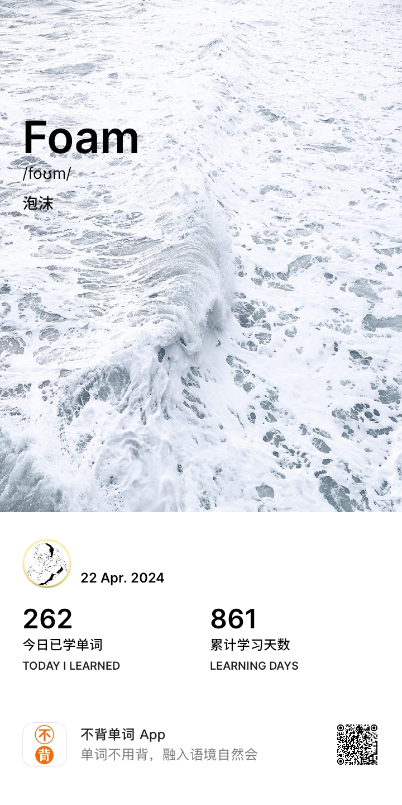

# 考研记录

> wxs 记录考研每日完成的任务 进行一个打卡

## 2024年4月22日

+ 数学
  + 武忠祥 网课 第14讲 常微分方程
  + 滚动复习 13讲 定积分应用
  + 做题 ch3 定积分 捏猫的什么时候才能做完啊

+ 英语
  + 背单词

    

  + 泛读

    

+ 专业课

  + 新课 ch5.1 + 5.2
  + 做题 ch5.1 + 5.2
  + 滚动复习 ch4

+ 其他

  + 编译原理复习 ch3 词法分析 + ch4 自顶向下的分析方法

------------------------------------

