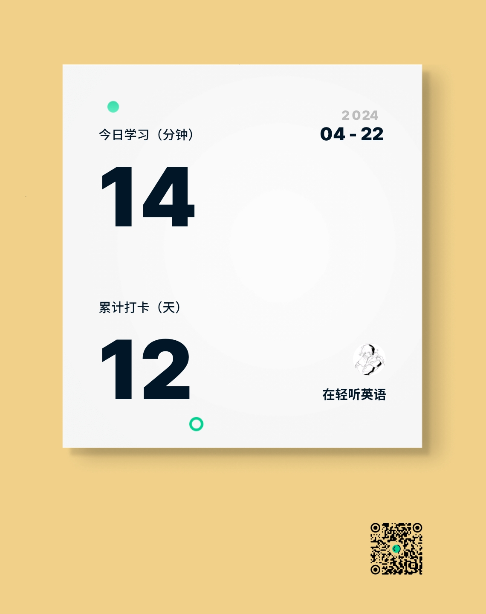

# 考研记录

> 记录考研每日完成的任务 进行一个打卡

## 四月

### 4.22 - Mon

+ 数学
  + 武忠祥 网课 第14讲 常微分方程
  + 滚动复习 13讲 定积分应用
  + 做题 ch3 定积分 捏猫猫的什么时候才能做完啊

+ 英语
  + 背单词

    

  + 泛读

    

+ 专业课

  + 新课 ch5.1 + 5.2
  + 做题 ch5.1 + 5.2
  + 滚动复习 ch4

+ 其他

  + 编译原理复习 ch3 词法分析 + ch4 自顶向下的分析方法

### :arrow_right: 4.23 - Tue

> :bell:**事件**
>
> + 下午: 上课 - 存储技术基础
> + 晚上: 补课 - 存储技术基础

### 4.24 - Wed

> :bell:**事件**
>
> + 上午: 上课 - 编译原理
> + 上午: 答疑 - 编译原理
> + 上午: 考试 - 编译原理

### 4.29 - Mon

> :bell:**事件**
>
> + 下午: 出去玩

----------------------

## 五月

### 5.4 - Sat

> :bell:**事件**
>
> + 全天: 去漫展

### 5.5 - Sun

> :bell:**事件**
>
> + 全天: 去看演唱会

